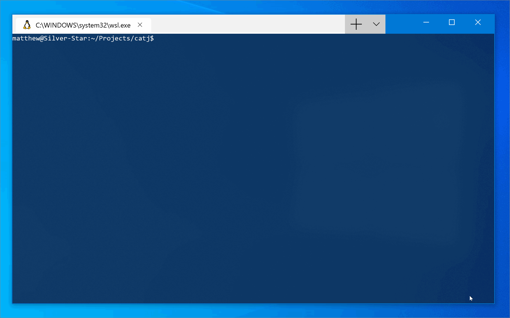

# catj

[](https://dev.azure.com/mattleibow/OpenSource/_build/latest?definitionId=17&branchName=master)  

Displays JSON files in a flat format.

## Install

```sh
dotnet tool install -g catj
```

## Usage

```sh
catj [file]
```

OR

```sh
cat [file] | catj
```

## Example

Input:

```json
{
  "mappings": {
    "templates": [
      {
        "fields": {
          "mapping": {
            "norms": false,
            "type": "text",
            "fields": {
              "keyword": {
                "ignore_above": 256,
                "type": "keyword"
              }
            }
          }
        }
      }
    ]
  }
}
```

Output:

```txt
.mappings.templates[0].fields.mapping.norms = False
.mappings.templates[0].fields.mapping.type = "text"
.mappings.templates[0].fields.mapping.fields.keyword.ignore_above = 256
.mappings.templates[0].fields.mapping.fields.keyword.type = "keyword"
```


